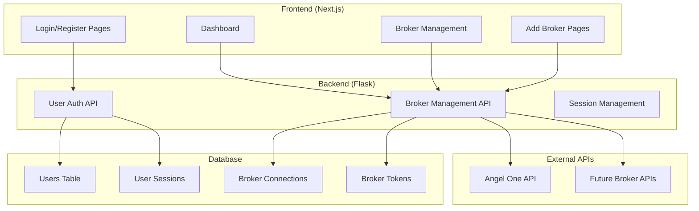
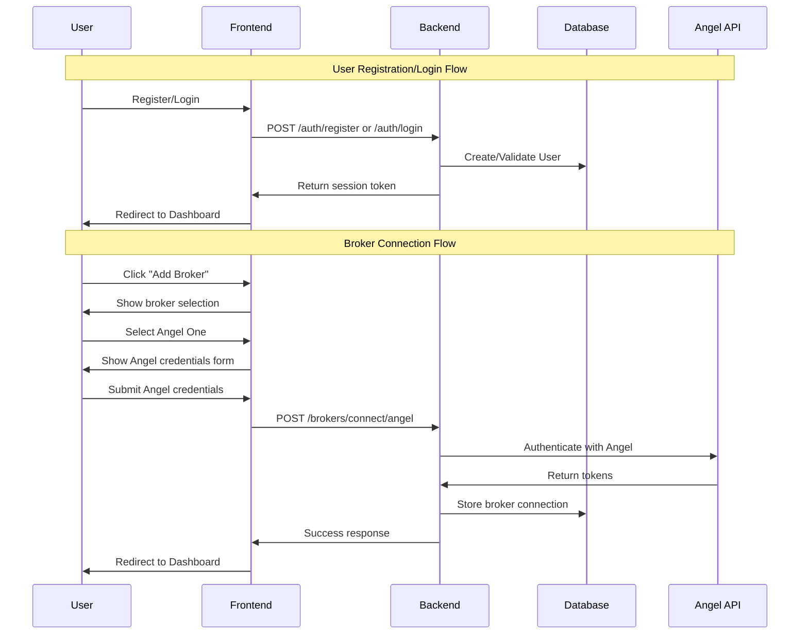

# Design Document

## Overview

The User Authentication System will transform the current broker-specific authentication into a flexible, multi-broker platform. The system separates user identity management from broker credential management, allowing users to register once and connect multiple broker accounts over time.

### Key Design Principles

1. **Separation of Concerns**: User authentication is independent of broker authentication
2. **Extensibility**: Architecture supports adding new brokers without major changes
3. **Security**: Secure credential storage and session management
4. **User Experience**: Simplified onboarding with progressive broker connection
5. **Backward Compatibility**: Preserve existing functionality during transition

## Architecture

### High-Level Architecture



### Authentication Flow



## Components and Interfaces

### Backend Components

#### 1. User Authentication Service (`auth_service.py`)

**Purpose**: Handles user registration, login, and session management

**Key Methods**:
- `register_user(username, email, password)` → User creation with password hashing
- `authenticate_user(email, password)` → User login validation
- `create_session(user_id)` → Session token generation
- `validate_session(token)` → Session validation
- `logout_user(token)` → Session cleanup

#### 2. Broker Management Service (`broker_service.py`)

**Purpose**: Manages broker connections and credentials

**Key Methods**:
- `get_supported_brokers()` → List of available brokers
- `connect_broker(user_id, broker_type, credentials)` → Establish broker connection
- `get_user_brokers(user_id)` → Retrieve user's connected brokers
- `disconnect_broker(user_id, broker_id)` → Remove broker connection
- `refresh_broker_tokens(user_id, broker_id)` → Token refresh handling

#### 3. Angel Broker Adapter (`brokers/angel_adapter.py`)

**Purpose**: Angel One specific integration logic

**Key Methods**:
- `authenticate(client_id, pin, totp, api_key)` → Angel authentication
- `refresh_token(refresh_token)` → Token refresh
- `validate_connection(access_token)` → Connection health check

### Frontend Components

#### 1. Authentication Pages

**Login Page** (`/login`):
- Simple email/password form
- Error handling and validation
- Redirect to dashboard on success

**Register Page** (`/register`):
- Username, email, password fields
- Password strength validation
- Terms acceptance checkbox

#### 2. Dashboard Components

**Main Dashboard** (`/dashboard`):
- Welcome message with user info
- Connected brokers summary
- Prominent "Add Broker" call-to-action
- Quick actions for each connected broker

**Broker Management** (`/dashboard/brokers`):
- List of connected brokers with status
- Connection health indicators
- Disconnect/reconnect options
- Add new broker button

#### 3. Broker Connection Flow

**Broker Selection** (`/brokers/add`):
- Grid of available brokers
- Angel One prominently featured
- "Coming Soon" indicators for future brokers

**Angel Connection** (`/brokers/add/angel`):
- Form for Angel credentials (Client ID, PIN, TOTP, API Key)
- Real-time validation
- Connection status feedback

## Data Models

### Users Table

```sql
CREATE TABLE users (
    id INTEGER PRIMARY KEY AUTOINCREMENT,
    username VARCHAR(50) UNIQUE NOT NULL,
    email VARCHAR(100) UNIQUE NOT NULL,
    password_hash VARCHAR(255) NOT NULL,
    is_active BOOLEAN DEFAULT TRUE,
    created_at TIMESTAMP DEFAULT CURRENT_TIMESTAMP,
    updated_at TIMESTAMP DEFAULT CURRENT_TIMESTAMP
);
```

### User Sessions Table

```sql
CREATE TABLE user_sessions (
    id INTEGER PRIMARY KEY AUTOINCREMENT,
    user_id INTEGER NOT NULL,
    session_token VARCHAR(255) UNIQUE NOT NULL,
    expires_at TIMESTAMP NOT NULL,
    created_at TIMESTAMP DEFAULT CURRENT_TIMESTAMP,
    FOREIGN KEY (user_id) REFERENCES users(id)
);
```

### Broker Connections Table

```sql
CREATE TABLE broker_connections (
    id INTEGER PRIMARY KEY AUTOINCREMENT,
    user_id INTEGER NOT NULL,
    broker_type VARCHAR(50) NOT NULL,
    broker_user_id VARCHAR(100) NOT NULL,
    display_name VARCHAR(100),
    is_active BOOLEAN DEFAULT TRUE,
    connected_at TIMESTAMP DEFAULT CURRENT_TIMESTAMP,
    last_sync_at TIMESTAMP,
    FOREIGN KEY (user_id) REFERENCES users(id),
    UNIQUE(user_id, broker_type, broker_user_id)
);
```

### Broker Tokens Table

```sql
CREATE TABLE broker_tokens (
    id INTEGER PRIMARY KEY AUTOINCREMENT,
    connection_id INTEGER NOT NULL,
    access_token TEXT NOT NULL,
    refresh_token TEXT,
    feed_token TEXT,
    expires_at TIMESTAMP,
    created_at TIMESTAMP DEFAULT CURRENT_TIMESTAMP,
    updated_at TIMESTAMP DEFAULT CURRENT_TIMESTAMP,
    FOREIGN KEY (connection_id) REFERENCES broker_connections(id)
);
```

## Error Handling

### User Authentication Errors

- **Invalid Credentials**: Generic message to prevent username enumeration
- **Account Locked**: After multiple failed attempts
- **Session Expired**: Automatic redirect to login
- **Registration Conflicts**: Clear messaging for duplicate usernames/emails

### Broker Connection Errors

- **Invalid Broker Credentials**: Display specific broker error messages
- **Connection Timeout**: Retry mechanism with user feedback
- **Token Expiration**: Automatic refresh or re-authentication prompt
- **API Rate Limits**: Queue requests and inform user of delays

### Error Response Format

```json
{
  "status": "error",
  "error_code": "INVALID_CREDENTIALS",
  "message": "The provided credentials are invalid",
  "details": {
    "field": "password",
    "suggestion": "Please check your password and try again"
  }
}
```

## Testing Strategy

### Unit Tests

**Backend Services**:
- User registration validation
- Password hashing and verification
- Session token generation and validation
- Broker authentication flows
- Database operations

**Frontend Components**:
- Form validation logic
- Authentication state management
- Error handling and display
- Navigation flows

### Integration Tests

**Authentication Flow**:
- Complete registration → login → dashboard flow
- Session persistence across page refreshes
- Logout and session cleanup

**Broker Connection Flow**:
- End-to-end broker connection process
- Token refresh mechanisms
- Error handling for failed connections

### API Tests

**User Authentication Endpoints**:
- POST /auth/register
- POST /auth/login
- POST /auth/logout
- GET /auth/session

**Broker Management Endpoints**:
- GET /brokers/supported
- POST /brokers/connect/angel
- GET /brokers/user-connections
- DELETE /brokers/disconnect/{id}

### Security Tests

- Password strength validation
- SQL injection prevention
- Session token security
- Credential encryption at rest
- HTTPS enforcement
- CORS configuration

## Migration Strategy

### Phase 1: Parallel System Setup

1. Create new user authentication tables alongside existing auth system
2. Implement new registration/login endpoints
3. Build new frontend authentication pages
4. Test new system in isolation

### Phase 2: Broker Connection Integration

1. Create broker management tables and APIs
2. Implement Angel One adapter using existing authentication logic
3. Build broker management UI components
4. Test broker connection flows

### Phase 3: Data Migration

1. Create migration script to convert existing users to new system
2. Migrate existing broker credentials to new broker connections table
3. Update session management to use new user sessions
4. Preserve existing user access during migration

### Phase 4: Cutover and Cleanup

1. Update frontend routing to use new authentication pages
2. Redirect old authentication endpoints to new system
3. Remove deprecated authentication code
4. Monitor system performance and user feedback

## Security Considerations

### Password Security

- Minimum 8 characters with complexity requirements
- bcrypt hashing with salt rounds ≥ 12
- Password reset functionality with secure tokens
- Account lockout after failed attempts

### Session Management

- Secure, random session tokens (256-bit)
- HTTP-only cookies for token storage
- Session expiration (24 hours default)
- Secure token transmission (HTTPS only)

### Broker Credential Storage

- Encrypt sensitive broker credentials at rest
- Separate encryption keys for different credential types
- Regular token rotation where supported by broker APIs
- Audit logging for credential access

### API Security

- Rate limiting on authentication endpoints
- CORS configuration for frontend domains
- Input validation and sanitization
- SQL injection prevention through parameterized queries